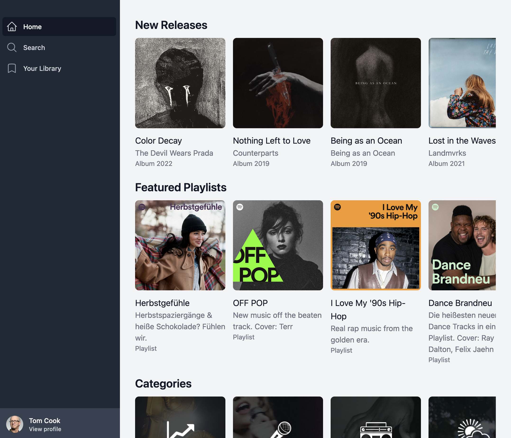

# React coding challenge

## 💻 Setup

- Install [Git](https://git-scm.com)
- Install [Node.js 16.17.0](https://nodejs.org)
- Install [Yarn 1.12.19](https://classic.yarnpkg.com/en/docs/install)
- Pull the repository
- Run `yarn install`
- Run `yarn test`
- Start the local dev server with `yarn dev`

## 💡 Synopsis

We want to create a custom Spotify interface that will be mounted to the wall in the office gaming room. It will be permanentely connected to the Kaleido Spotify account and display the newest releases and featured playlists the users can select to start the music in this room.

## 🚀 Getting started

- Run all the Setup steps
- All required API endpoints and credentials can be found in `src/config.ts`.
- You may use any libraries you want, but please don't use any already existing spotify client libraries.
- Feel free to reorganize the project structure as you see fit.

## 📖 Requirements

- Fetch and display albums released this week
- Fetch and display featured playlists
- Fetch and display featured categories

## ❌ Non-requirements

- Server-side API calls
- SSR
- SEO

## 📎 References

- [Spotify Web API](https://developer.spotify.com/documentation/web-api/)

## 🖼️ Screenshot

